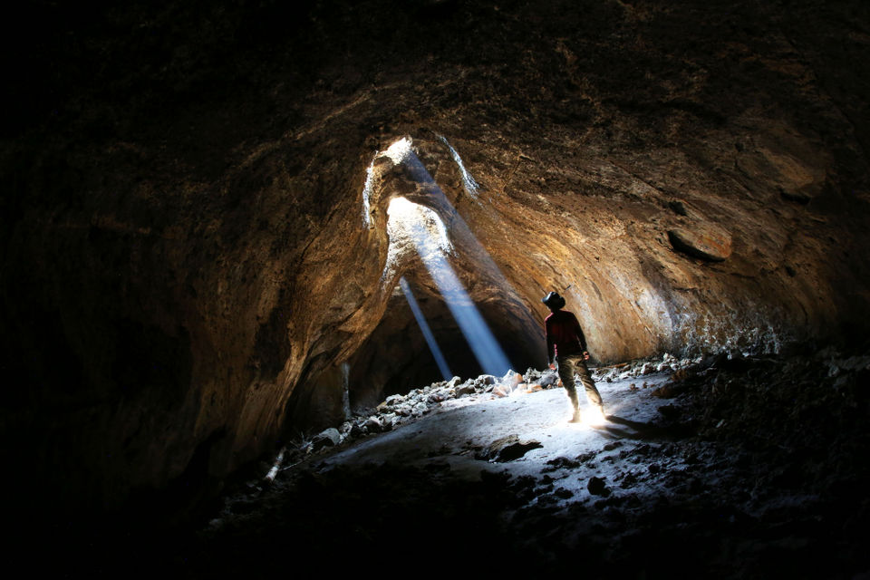
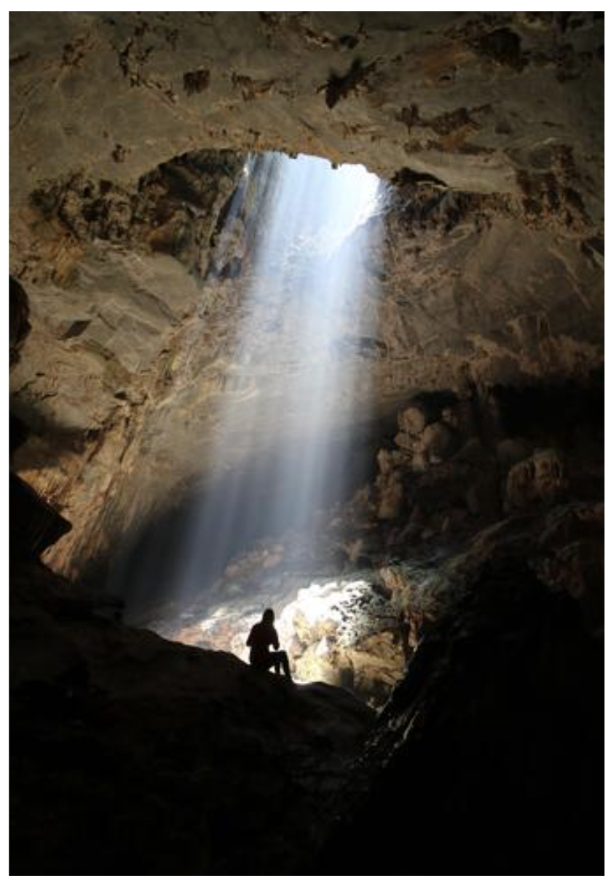

# MOTHNODE_ Wretched

**Listen now:** 

## Project Data

Description.

> **Title:** Wretched  / **Featuring:** 

> **Production:**  / **Lyrics:** 

> **Beat:**

> **Narrative Design:**

> **Music Video Credits:**


## Lyrics

```
forlorn in the mist of the fallen hopes
wretched eyes, i'm torn between the love and rope
since most of the time it's been done and they're gone
can't rely on my senses they're fully at fault

can't trust in my verses, torn to shreds
with excess, so i'm blind and i'm done for
demise reckless within

i've been routing my way
risk my heart and the blood 
until finally called just so 
give me a dose

just give me a dose
just give me a dose

forlorn in the mist of the fallen hopes
wretched eyes, i'm torn between the love and rope
since most of the time it's been done and they're gone
can't rely on my senses they're truly at fault

can't trust in my verses, torn to shreds
with excess, so i'm blind and i'm done for
demise reckless within

reckless within
reckless within

...

can't you do it like that, 

I've been routing my way
risk my heart isn't just blocked until i finally cope
just give me a dose
just give me a dose

make it right  

```

## Lore Notes

## Music Video

Singing in a giant cave with a skylight coming through. Singing to the skylight. Tripod sensors deployed around.

## Short Cinematic Film

## Miscellaneous Notes
